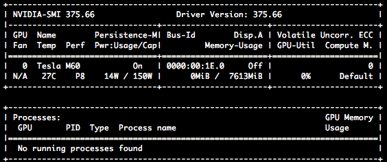

# Image Driver 1

## Background
First, here's a quick review of some relevant terminology:

* [**(Docker) Container**](https://www.docker.com/what-container): A self-contained virtual system for running software

* **Model**: A machine learning model implemented in one of several prominent frameworks (Tensorflow, Scikit, PyTorch, Theano, etc).

* **Replica**: A copy of a **model**. In practice, this is a single **container** running the model's code and dependencies.

* **Prediction Request**: A query sent to Clipper containing an application-specific input. For benchmarking purposes, each 
prediction request will contain an input of the type expected by the model being benchmarked (i.e. a 299x299x3 numpy array for 
the the VGG image featurization model).

* **Client**: Module of code for sending prediction requests to Clipper. Effectively, the driver file that you'll be using to benchmark models is a client.

* **Frontend**: A piece of Clipper's infrastructure that communicates with **clients** and or **replicas**. (For more information, see the [Clipper design doc](https://docs.google.com/document/d/1Ghc-CAKXzzRshSa6FlonFa5ttmtHRAqFwMg7vhuJakw/edit)).

This driver makes use of 4 heavyweight models: A VGG model for image featurization, an Inception V3 model for image featurization, 
a light boosted gradient model (LGBM) for feature classification, and one of the following for feature classification:
 * An SVM that performs kernel PCA for preprocessing
 * A kernel SVM
 * An [elastic net](http://scikit-learn.org/stable/modules/generated/sklearn.linear_model.ElasticNet.html) logistic regression model

The driver file,
[driver.py](driver.py), will help you benchmark each of this models with Clipper in isolation (one model at a time). The remaining sections of this README will get you started with the benchmarking process.

## Activate your Clipper Anaconda environment
Before proceeding, make sure to activate your Anaconda environment if it is not already activated. This can be done by running:
```sh
$ source activate clipper
```

## Pre-requisite: Setting up infrastructure
If the [high-perf-clipper branch](https://github.com/dcrankshaw/clipper/tree/high-perf-clipper) has been updated since you last
performed benchmarking, follow the subsequent instructions to build or install the latest benchmarking infrastructure components.

### Install the latest versions of Clipper's python modules:
Run the following command from the [model_composition directory](../../.)
```sh
$ ./setup_env.sh
```

### Build the latest Clipper docker images 
Run the following command from the clipper root directory to build the latest Clipper docker images 
(ZMQ Frontend, Management Frontend, etc):

```sh
$ ./bin/build_docker_images.sh
```

### Build the latest model docker images
Run the following command from the [containerized image driver 1 directory](.) 
to build docker images for models used by Image Driver 1:

```sh
$ ./containers/build_docker_images.sh
```

## Benchmarking with [driver.py](driver.py)

### The Driver API

The driver accepts the following arguments:
- **model_name**: The name of the model to benchmark. Must be one of the following: `vgg`, `inception`, `lgbm`, `kpca-svm`, `kernel-svm`, `elastic-net`
  * This argument is REQUIRED
  
- **duration**: The duration for which each iteration of the benchmark should run, in seconds
  * If unspecified, this argument has a default value of 120 seconds
  
- **batch_sizes**: The batch size configurations to benchmark. Each configuration will be benchmarked separately.
  * If unspecified, the driver will benchmark a single batch size configuration of size `2`.
  
- **num_replicas**: The "number of replicas" configurations to benchmark. Each configuration will be benchmarked separately.
  * If unspecified, the driver will benchmark a single "number of replicas" configuration of size `1`
  
- **model_cpus**: The cpu cores on which model replicas should be run. Clipper will automatically handle the placement of each replica on one or more of these cpu cores (as specified by **cpus_per_replica**).
  * If unspecified, the default set of cpu cores allocated depends on the specified model. You can view and modify these
  defaults [in the driver program](https://github.com/dcrankshaw/clipper/blob/4809caaccc7c6d646b19c51bcb54c6efdfa3a59c/model_composition/image_driver_1/containerized/driver.py#L102).

- **cpus_per_replica_nums**: The "number of cpu cores per replica" configurations to benchmark. Each configuration will be benchmarked
separately.
  * If unspecified, only a single "number of cpu cores per replica" configuration is benchmarked. This configuration
  depends on the model that is specified. You can view and modify these defaults [in the driver program](https://github.com/dcrankshaw/clipper/blob/4809caaccc7c6d646b19c51bcb54c6efdfa3a59c/model_composition/image_driver_1/containerized/driver.py#L100).

- **model_gpus**: The set of gpus on which to run replicas of the provided model. If you're running multiple replicas of
a model on GPUs, **each replica must have its own GPU**. Any replicas that don't have their own GPU will be executed on 
one or more of the CPU cores specified by **model_cpus**.
  * If unspecified, the set of gpus allocated depends on the specified model. You can view and modify these defaults
  [in the driver program](https://github.com/dcrankshaw/clipper/blob/4809caaccc7c6d646b19c51bcb54c6efdfa3a59c/model_composition/image_driver_1/containerized/driver.py#L70).
  * Note: This option should only be used with the Inception and VGG models, which support GPU execution.


### Examples

1. As an example, consider the following driver command:

   ```sh
   $ python driver.py --duration_seconds 120 --model_name vgg --num_replicas 1 2 3 4 --batch_sizes 1 2 4 8 16 32 \
                      --model_cpus 20 21 22 23 24 25 26 27 --cpus_per_replica_nums 1,2
   ```

   This command specifies that:

   1. The VGG model will be benchmarked using cpus `20-27`
   
   2. `4` different "number of replicas" and `6` different "batch size" configurations will be benchmarked
   
   3. `2` different "number of cpu cores per replica" configurations will be benchmarked
      - Note that we cannot experiment with more than `|model_cpus| / max(num_replicas)` cpu cores per replica.
      - This means that, for this example, `max(cpus_per_replica_nums) = 2 cores` 
        (as reflected in the **cpus_per_replica_num** argument)

   4. Therefore, a total of `4 * 6 * 2 = 48` iterations lasting 120 seconds will occur (one for each configuration)

2. The last command benchmarked the VGG model on various CPU configurations. However, this model may perform better on a GPU.
Therefore, we might also run the following driver command:

 
   ```sh
   $ python driver.py --duration_seconds 120 --model_name vgg --num_replicas 1 2 3 4 --batch_sizes 1 2 4 8 16 32 \
                      --model_gpus 0,1 --model_cpus 20 21 22 23 --cpus_per_replica_nums 2
   ```  

   This command specifies that:
   
   1. As before, the VGG model will be benchmarked
   
   2. As before, `4` different "number of replicas" and `6` different "batch size" configurations will be benchmarked
   
   3. When the number of replicas exceeds the number of model gpus (`2`), two replicas will be run on GPUs 
      (one on GPU 0 and one on GPU 1), and the remaining replicas will be run on CPU cores `20-23`
      
   4. Each CPU-bound replica will be allocated `2` CPU cores.

### Avoiding CPU resource conflicts
When you're running replicas of a CPU-intensive model on a set of cores, `C = {c_1, ..., c_n}`, you want to avoid
starting other processes on these cores (or model performance might suffer). Therefore, you need to **make sure of two things**:

1. The set of cpu cores, `C`, allocated to the model (via **model_cpus**) does NOT intersect with the set of cpu cores allocated
to other pieces of Clipper's infrastructure. Therefore, **avoid using the following cpu cores**:

   * Core 0: The CPU core allocated to [Redis](https://redis.io/topics/introduction) (Clipper's configuration database)
   * Core 8: The CPU core allocated to Clipper's management frontend
   * Cores 1-5, 9-13: The CPU cores allocated to Clipper's ZMQ frontend
   
   **Note:** These core numbers are [configured in the driver ](https://github.com/dcrankshaw/clipper/blob/e2e292c0637327fed73df6a689df6f67677c0330/model_composition/image_driver_1/containerized/driver.py#L54-L56), and you can easily change them if necessary.
   
2. The benchmarking driver ([driver.py](driver.py)) is not executed on any CPU cores present in `C = {c_1, ..., c_n}`. 
   To make sure of this, you can use [numactl](https://linux.die.net/man/8/numactl) to control the allocation of CPU cores
   to the driver. **The driver should be allocated at least 4 cores**.
   
   For example, consider the second driver command from the previous section. We specified via **model_cpus** that
   replicas of the VGG model were allocated CPU cores 20-23. Therefore, we should have used `numactl` to run ([driver.py](driver.py))
   on a different set of cores as follows:
   
   ```sh
   $ numactl -C 24,25,26,27 python driver.py --duration_seconds 120 --model_name vgg --num_replicas 1 2 3 4 \
                                             --batch_sizes 1 2 4 8 16 32 --model_gpus 0,1 --model_cpus 20 21 22 23 \
                                             --cpus_per_replica_nums 2
   ```

## Monitoring the benchmarking process
Once you've started a benchmark, there are some useful tools and logs that you can use to monitor behavior.

### Examining the logs
As you're running benchmarks, you can examine log output to verify expected behavior and gain further insight into model
performance.

#### Sanity check: p99 latency should increase
In order to maximize model throughput, the size of the batches of data being received by the model must be equivalent to the maximum batch size specified in the driver arguments. To ensure this, the client asynchronously
sends as many requests to Clipper as possible and receives responses asynchronously on a separate thread. Accordingly, you should
always observe that the **p99 latency** is monotonically increasing as the benchmark continues. This indicates that the request
queue for the benchmarked model is growing in size and, therefore, that the model is processing data in batches of the maximum size.
As an example, the following log output from a 30 second VGG model benchmark indicates increasing **p99 latency**, as expected:

```sh
$ python driver.py -m vgg -d 30 -g 1 -c 20 21 22 23 24 25 26
...
17-10-01:00:12:29 INFO     [driver.py:165] p99: 8.56166084, mean: 7.11386126, thruput: 5.63203102753
17-10-01:00:12:33 INFO     [driver.py:165] p99: 11.50452946, mean: 10.08846866, thruput: 15.6123929927
17-10-01:00:12:36 INFO     [driver.py:165] p99: 14.44521452, mean: 13.03074142, thruput: 15.6283014787
17-10-01:00:12:39 INFO     [driver.py:165] p99: 17.39584051, mean: 15.97694142, thruput: 15.5684718517
17-10-01:00:12:42 INFO     [driver.py:165] p99: 20.33137019, mean: 18.92000688, thruput: 15.6489771672
17-10-01:00:12:45 INFO     [driver.py:165] p99: 23.27800143, mean: 21.86211496, thruput: 15.6145285068
17-10-01:00:12:49 INFO     [driver.py:165] p99: 26.22048481, mean: 24.80313296, thruput: 15.6156306216
17-10-01:00:12:52 INFO     [driver.py:165] p99: 29.1693123, mean: 27.75053036, thruput: 15.5850924227
17-10-01:00:12:55 INFO     [driver.py:165] p99: 32.12742159, mean: 30.70249536, thruput: 15.5380886721
17-10-01:00:12:58 INFO     [driver.py:165] p99: 35.07986336, mean: 33.65979412, thruput: 15.5756058599
17-10-01:00:13:01 INFO     [driver.py:165] p99: 38.0221982, mean: 36.60936036, thruput: 15.6185280724
17-10-01:00:13:05 INFO     [driver.py:165] p99: 40.95565917, mean: 39.5434591, thruput: 15.6544891439
17-10-01:00:13:08 INFO     [driver.py:165] p99: 43.90258185, mean: 42.48265662, thruput: 15.597519121
17-10-01:00:13:11 INFO     [driver.py:165] p99: 46.84866518, mean: 45.43198676, thruput: 15.5910067331
```

If you don't find this to be the case, try reducing the [client sleep delay between requests](https://github.com/dcrankshaw/clipper/blob/4809caaccc7c6d646b19c51bcb54c6efdfa3a59c/model_composition/image_driver_1/containerized/driver.py#L195).
   
#### Examine Clipper's internal metrics 
After the benchmark concludes, you will see log output with a path to a dump of Clipper's internal metrics. Here's 
an example path output and its corresponding log file contents:
```sh
...
17-10-01:00:13:13 INFO     [driver_utils.py:78] Saved results to /home/ubuntu/clipper/model_composition/image_driver_1/containerized/gpu_and_batch_size_experiments/results-171001_001313.json
```

```sh
    "clipper_metrics": {
        "histograms": [
            {
                "internal:rpc_request_queueing_delay": {
                    "p99": "0", 
                    "min": "0", 
                    "max": "0", 
                    "p95": "0", 
                    "std_dev": "0", 
                    "size": "0", 
                    "p50": "0", 
                    "unit": "microseconds", 
                    "mean": "0"
                }
            }, 
            {
                "app:vgg:prediction_latency": {
                    "p99": "47966271.6200000000463", 
                    "min": "4225172", 
                    "max": "48321143", 
                    "p95": "46276901.0999999924097", 
                    "std_dev": "12333757.5717325170317", 
                    "size": "725", 
                    "p50": "26982273", 
                    "unit": "microseconds", 
                    "mean": "27016849.7255172413788"
                }
            }, 
            {
                "model:vgg:1:prediction_latency": {
                    "p99": "132623.200000000083037", 
                    "min": "126085", 
                    "max": "4224249", 
                    "p95": "129316.800000000000296", 
                    "std_dev": "227344.464048498445166", 
                    "size": "363", 
                    "p50": "128157", 
                    "unit": "microseconds", 
                    "mean": "143376.261707988980717"
                }
            }, 
            {
                "model:vgg:1:batch_size": {
                    "p99": "2", 
                    "min": "1", 
                    "max": "2", 
                    "p95": "2", 
                    "std_dev": "0.0524140429488717577568", 
                    "size": "363", 
                    "p50": "2", 
                    "unit": "queries", 
                    "mean": "1.9972451790633608883"
                }
            }
        ], 
        "meters": [
            {
                "internal:aggregate_model_throughput": {
                    "rate": "5.4055865252998672", 
                    "rate_1min": "7.8944671336492327", 
                    "rate_15min": "0.71736659804987923", 
                    "unit": "events per second", 
                    "rate_5min": "2.0543397583024028"
                }
            }, 
            {
                "app:vgg:prediction_throughput": {
                    "rate": "0", 
                    "rate_1min": "0", 
                    "rate_15min": "0", 
                    "unit": "events per second", 
                    "rate_5min": "0"
                }
            }, 
            {
                "model:vgg:1:prediction_throughput": {
                    "rate": "6.2158880103776699", 
                    "rate_1min": "8.2222152195703249", 
                    "rate_15min": "0.75975524306672781", 
                    "unit": "events per second", 
                    "rate_5min": "2.1700146810288308"
                }
            }
        ], 
        "ratio_counters": [
            {
                "app:vgg:default_prediction_ratio": {
                    "ratio": "0"
                }
            }, 
            {
                "model:vgg:1:cache_hit_ratio": {
                    "ratio": "0"
                }
            }
        ], 
        "counters": [
            {
                "internal:aggregate_num_predictions": {
                    "count": "10000"
                }
            }, 
            {
                "app:vgg:num_predictions": {
                    "count": "725"
                }
            }, 
            {
                "model:vgg:1:num_predictions": {
                    "count": "725"
                }
            }
        ]
    }
```

Note that, for shorter durations, Clipper's model throughput metric (`model:vgg:1:prediction_throughput` in this case) indicates
lower throughput than the benchmark client. This is expected behavior due to the temporal sensitivity of the meter implementation.
For durations longer than 60 seconds, the one-minute rate should more closely reflect client throughput. Additionally,
application latency (`app:vgg:prediction_latency` in this case) should be substantially higher than model latency 
(`model:vgg:1:prediction_latency` in this case) due to the addition of network latencies as well as queueing delay in the calculation.

### Monitoring CPU usage
If you're running replicas of a CPU-intensive model on a set of cores, `{c_1, ..., c_n}`, you can use [htop](http://hisham.hm/htop/)
to monitor for higher activity on those cores. 

### Monitoring GPU usage
If you're benchmarking the VGG or Inception models on a GPU, you can make sure that the model is using the GPU via the 
[nvidia-smi](http://developer.download.nvidia.com/compute/cuda/6_0/rel/gdk/nvidia-smi.331.38.pdf) command.

If no tasks are running on the GPU, the output of `nvidia-smi` will look similar to the following:



In contrast, if tasks are running, you should see non-zero (hopefully high) memory and utilization, as well as one or more active processes (Note: This output was obtained from a machine with 2 GPUs):


### Examining Docker log output
At any time during the benchmark, you can view log output for model replicas and frontends via their respective containers.
First, run `docker ps` to obtain a list of actively running containers. Here's an example output during a VGG benchmark:

```sh
$ docker ps

CONTAINER ID        IMAGE                                 COMMAND                  CREATED             STATUS              PORTS                                                                              NAMES
8154b855f988        model-comp/vgg-feats                  "python /container..."   8 minutes ago       Up 8 minutes        6006/tcp, 8888/tcp                                                                 inspiring_mcclintock
b89c6d5d7ace        clipper/zmq_frontend:develop          "/clipper/release/..."   9 minutes ago       Up 9 minutes        0.0.0.0:1337->1337/tcp, 0.0.0.0:4455-4456->4455-4456/tcp, 0.0.0.0:7000->7000/tcp   query_frontend-91651
7843f04950bb        clipper/management_frontend:develop   "/clipper/release/..."   9 minutes ago       Up 9 minutes        0.0.0.0:1338->1338/tcp                                                             mgmt_frontend-32434
526168ebd97d        redis:alpine                          "docker-entrypoint..."   9 minutes ago       Up 9 minutes        6379/tcp, 0.0.0.0:6380->6380/tcp                                                   redis-40382
```

To view log output for the first (and only) VGG replica in this example, you would simply invoke the `docker logs` command and specify the **container id** corresponding to the container with image name `model-comp/vgg-feats` as follows:

```sh
$ docker logs 8154b855f988
...
Got start of message 1042
recv: 172.000000 us, parse: 195.000000 us, handle: 0.123944 seconds
Got start of message 1043
recv: 169.000000 us, parse: 162.000000 us, handle: 0.124815 seconds
Got start of message 1044
recv: 145.000000 us, parse: 160.000000 us, handle: 0.124611 seconds
Got start of message 1045
recv: 150.000000 us, parse: 160.000000 us, handle: 0.123407 seconds
Got start of message 1046
recv: 144.000000 us, parse: 183.000000 us, handle: 0.125167 seconds
Got start of message 1047
recv: 147.000000 us, parse: 185.000000 us, handle: 0.123971 seconds
Got start of message 1048
recv: 160.000000 us, parse: 187.000000 us, handle: 0.124360 seconds
Got start of message 1049
recv: 209.000000 us, parse: 323.000000 us, handle: 0.125007 seconds
Got start of message 1050
recv: 220.000000 us, parse: 290.000000 us, handle: 0.123710 seconds
Got start of message 1051
recv: 210.000000 us, parse: 280.000000 us, handle: 0.123962 seconds
Got start of message 1052
recv: 203.000000 us, parse: 284.000000 us, handle: 0.125308 seconds
Got start of message 1053
recv: 206.000000 us, parse: 285.000000 us, handle: 0.124409 seconds
Got start of message 1054
recv: 196.000000 us, parse: 228.000000 us, handle: 0.124646 seconds
Got start of message 1055
recv: 152.000000 us, parse: 225.000000 us, handle: 0.123772 seconds
Got start of message 1056
recv: 145.000000 us, parse: 162.000000 us, handle: 0.124338 seconds
Got start of message 1057
recv: 200.000000 us, parse: 293.000000 us, handle: 0.124924 seconds
Got start of message 1058
recv: 199.000000 us, parse: 227.000000 us, handle: 0.123864 seconds
Got start of message 1059
recv: 149.000000 us, parse: 224.000000 us, handle: 0.124388 seconds
Got start of message 1060
recv: 162.000000 us, parse: 229.000000 us, handle: 0.124282 seconds
Got start of message 1061
recv: 160.000000 us, parse: 183.000000 us, handle: 0.123717 seconds
Got start of message 1062
recv: 149.000000 us, parse: 222.000000 us, handle: 0.123505 seconds
...
```

From the logs, you can see that the model replica is actively processing messages with an average per-batch latency of roughly 120 milliseconds.
